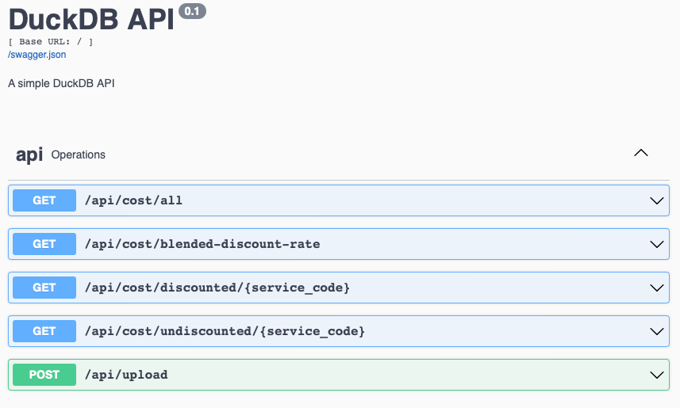

# Ducks
Parquet and DuckDB exploration

## Introduction
This project demonstrates the use of DuckDB for exploring and querying Parquet files. It provides a Dockerized setup for ease of deployment and includes a web interface for interacting with the data.

## Prerequisites
- Docker and Docker Compose must be installed.

## Installation
1. **Clone the Repository** [ducks](https://github.com/Valimere/ducks) repo and cd into it
2. Build and Run the Application `docker compose up --build` 

## Usage
1. Index Page: http://127.0.0.1:5001/index.html links to other pages
2. Costs Page: http://127.0.0.1:5001/costs.html Page to get Undiscounted, Discounted, and Blended Rates.
3. API Documentation: http://127.0.0.1:5001/api/docs OpenAPI docs showing the available routes


## OpenAPI for API endpoints



## Uploading Parquet File
To upload a Parquet file, use the following curl command:
```shell
curl -X 'POST' \
  'http://127.0.0.1:5001/api/upload' \
  -H 'accept: application/json' \
  -H 'Content-Type: multipart/form-data' \
  -F 'file=@data.snappy.parquet'
```
On success, you should receive:
```json
{"message": "File uploaded and ingested successfully"}
```

## Assumptions
* Docker and Docker Compose are installed or can be installed.
* Ingesting Parquet files via POST API is acceptable.
* Due to the simplicity of the business logic in this take-home assignment, testing is minimal.

## Future Work

* **Testing**: Enhance the testing framework to include comprehensive unit and integration tests. Address issues with Docker and the read-only file system to facilitate seamless test execution.
* **Handling Multiple Files**: Develop functionality to manage multiple Parquet files. This involves creating summary tables with aggregated data during ingestion. Each file should create a temporary table to perform necessary aggregations, and then update the persisted billing data incrementally.
* **User Input Enhancement**: Improve the user interface by implementing a dropdown or autocomplete feature for service codes. This allows users to select or type a service code and press enter, eliminating the need to manually type the full service code.
* **Scaling for Large Data Volumes**: Optimize the system to handle a large number of files efficiently. Implement the **Handling Multiple Files** strategy to front-load computations and use a summary table for quick selections. Monitor memory and disk usage to ensure performance. Consider keeping the summary table in memory and storing the rest of the data on disk, leveraging DuckDB's indexing capabilities.
* **Multi-Tenancy Support**: Design the database schema to support multiple customers. Create separate `customer_data` and `customer_aggregates` tables for each customer, along with a `customers` table for cross-customer calculations and analyses.
* **Logging**: Expand logging capabilities to integrate with the larger logging ecosystem. If a centralized logging service exists, send logs and telemetry data to it. This would improve monitoring, debugging, and performance analysis.
* **Authentication**: Implement authentication mechanisms to secure access to the application. This would involve setting up user authentication and authorization. 

## Comments
* Initially, loading the Parquet file consumed 10MB on disk. Filtering out results with a WHERE clause for 'usage' worked but felt contrary to the restrictions.
* Changing the ingestion to only accept 'usage' entries increased the disk size to ~18MB which I didn't expect. This may be due to DuckDB's internal handling of Parquet optimizations. For the scope of this take-home assignment, this behavior is noted but not further optimized.

## Meta Questions
* **Time spent**: 
  * I haven't used duckdb specifically before so reading documentation for 1-2 hours
  * Coding the application around 6 hours
* **Language choice**: Python is the language I have the most experience with at ~8 years.
* **Instruction clarity**: I really liked this assignment. I got to learn a bit more about AWS billing and a lot about DuckDB. I'm impressed with how quickly my machine ingested the data and performed the calculations. took only a couple of seconds for the parquet to be ingested.
